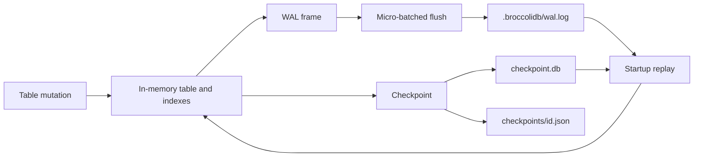

# @noorm/broccolidb

Portable, dependency-free in-memory tables with explicit file-backed durability.

BroccoliDB is an embeddable TypeScript database kernel for applications that
want a fast table hot path without SQLite, Kysely, a native addon, or a server
process. Records live in memory for reads and indexes; the kernel persists
mutations through a micro-batched, checksum-linked write-ahead log (WAL),
periodic JSON checkpoints, and an optional content-addressable storage (CAS)
vault for large blobs.

> BroccoliDB is a table-first embedded library, not a SQL engine or a remote
> database service. Its public contracts are TypeScript interfaces and
> deterministic file formats.

[](https://nodejs.org/)
[](https://www.typescriptlang.org/)
[](#portability-and-boundaries)
[](LICENSE)

## Table of contents

- [At a glance](#at-a-glance)
- [Quick start](#quick-start)
- [How durability works](#how-durability-works)
- [Public surface](#public-surface)
- [Storage layout](#storage-layout)
- [Portability and boundaries](#portability-and-boundaries)
- [Documentation](#documentation)
- [Development and verification](#development-and-verification)
- [Compatibility policy](#compatibility-policy)
- [License](#license)

## At a glance

| Capability | What it provides |
|---|---|
| In-memory tables | Typed records, CRUD, bulk writes, TTL expiration, snapshots, and reactive change events |
| Indexes | Equality, sorted/range, composite, and prefix indexes |
| Queries | Operator filters, boolean clauses, ordering, pagination, a fluent builder, and deterministic natural-language parsing |
| Aggregation | `sum`, `avg`, `min`, `max`, `count`, `stddev`, grouping, `having`, and grand totals |
| Durability | Micro-batched WAL frames, checksum validation, checkpoint rotation, replay, and rollback |
| Blob storage | SHA-256 addressed files, optional Brotli compression, read verification, quarantine, and garbage collection |
| Coordination | Re-entrant async mutex and kernel-level transaction boundary |
| Portability | ESM package, Node built-ins only at runtime, no SQLite or native ABI |

## Quick start

```bash
npm install @noorm/broccolidb
```

```ts
import { BroccoliDatabaseKernel } from "@noorm/broccolidb"

type User = {
  id: string
  name: string
  team: string
  active: boolean
}

const db = new BroccoliDatabaseKernel({ workspaceRoot: "./state" })
await db.start()

const users = db.getTable<User>("users")
users.createIndex("team")
users.createIndex("active")

await db.transaction(async () => {
  users.put("user-1", { id: "user-1", name: "Ada", team: "platform", active: true })
  users.put("user-2", { id: "user-2", name: "Grace", team: "platform", active: false })
})

const activePlatformUsers = users.query({
  where: { team: "platform", active: true },
})

console.log(activePlatformUsers)
console.log(await db.health())

await db.checkpoint("after-initial-users")
await db.stop()
```

The package is ESM-only. The `workspaceRoot` directory is created on demand;
the kernel stores its durable state below `workspaceRoot/.broccolidb/`.

## How durability works



A mutation updates the in-memory table immediately and schedules a WAL frame.
Call `flush()`, use `transaction()`, call `checkpoint()`, or shut down with
`stop()` when the application needs the buffered frames written before it
continues. On the next `start()`, BroccoliDB loads the latest base checkpoint
and replays the remaining WAL frames.

For a stable restore point, use:

```ts
const checkpoint = await db.checkpoint("before-import")
// ... perform work ...
await db.rollback(checkpoint.checkpointId)
```

The checkpoint record contains a timestamp, frame index, record counts, and a
SHA-256 hash of the serialized table snapshot. See the [operations guide](docs/OPERATIONS.md)
for backup, corruption, and multi-process guidance.

## Public surface

The package entry point re-exports the contracts and implementations needed by
an embedding application:

| Area | Primary exports | Source |
|---|---|---|
| Kernel | `BroccoliDatabaseKernel`, `broccolidb`, `DatabaseKernelOptions` | `src/broccolidb-kernel.ts` |
| Tables and contracts | `IDbTable`, `DbQueryOptions`, `DbPutOptions`, index/query/change types | `src/broccolidb.contracts.ts` |
| Queries | `BroccoliNaturalQueryParser`, `IFluentQueryBuilder` | `src/broccolidb-natural-query.ts` and contracts |
| Aggregation | `DbAggregateQuery`, `DbAggregateResult`, aggregate metrics | `src/broccolidb-aggregation.ts` and contracts |
| WAL | `BroccoliWriteAheadLog`, `WalIntegrityError`, `WalFrame` | `src/broccolidb-wal.ts` |
| CAS | `BroccoliCASStorageService`, `StorageIntegrityError` | `src/broccolidb-cas.ts` |
| Locking | `ReentrantAsyncMutex`, `DatabaseLockError`, `DeadlockTimeoutError` | `src/broccolidb-mutex.ts` |
| Prompt compression | `TokenCompressionService`, `tokenCompressionService` | `src/TokenCompressionService.ts` |

The detailed signatures and examples live in the [API reference](docs/API.md).

## Storage layout

```text
<workspaceRoot>/
└── .broccolidb/
    ├── wal.log                  # append-only JSONL mutation journal
    ├── wal.log.old              # previous journal after checkpoint rotation
    ├── checkpoint.db            # latest atomic base snapshot
    ├── checkpoints/<id>.json    # named checkpoint history
    └── cas/
        ├── blobs/<00-ff>/<sha>  # content-addressed payloads
        └── corrupt/             # quarantined payloads and manifest.jsonl
```

Treat this directory as application state. Back it up only while the kernel is
stopped or after an explicit `flush()`/`checkpoint()`. Do not edit WAL or
checkpoint files by hand; a malformed WAL frame raises `WalIntegrityError`.

## Portability and boundaries

BroccoliDB intentionally has:

- zero production dependencies in `package.json`;
- no SQLite, `better-sqlite3`, Kysely, native modules, or Electron ABI coupling;
- no network service, daemon, or background process;
- ordinary JSON, JSONL, SHA-256, Brotli, and filesystem primitives;
- a Node.js `>=18` engine requirement.

BroccoliDB does not provide SQL parsing, migrations, a cross-process lock, a
replicated log, or provider-specific billing/token accounting. The prompt token
compressor uses a four-characters-per-token estimate as a budget signal, not as
an API provider billing measurement.

## Documentation

The documentation follows a layered path: **Concepts → How it works →
Reference → Operations → Decisions**.

- [Documentation map](docs/README.md) — choose a reading path by role.
- [Brief](docs/BRIEF.md) — problem, solution, guarantees, and fit.
- [Architecture](docs/ARCHITECTURE.md) — layers, lifecycle, files, and failure model.
- [API reference](docs/API.md) — public types, methods, and query examples.
- [Operations guide](docs/OPERATIONS.md) — durability, backup, recovery, health, and GC.
- [Troubleshooting](docs/TROUBLESHOOTING.md) — symptom → cause → action runbooks.
- [Glossary](docs/GLOSSARY.md) — canonical vocabulary.
- [Design philosophy](docs/PHILOSOPHY.md) — principles and rejected alternatives.
- [Architecture decisions](docs/adr/README.md) — durable decisions and their consequences.
- [Contributing](docs/CONTRIBUTING.md) — source map, workflow, and contract checklist.
- [Release notes](docs/RELEASE_NOTES.md) — supported package history.

## Development and verification

```bash
npm install
npm run build
npm test
npm run docs:check
npm run check
npm pack --dry-run
```

`npm test` builds the package and runs the TypeScript tests under `test/`.
`npm run docs:check` verifies the documentation map and required relative
links. `npm run check` is the release-oriented local gate.

## Compatibility policy

The standalone package is the supported BroccoliDB implementation. The removed
in-repository SQLite implementation is not a compatibility target. New code
should import `@noorm/broccolidb` from the package entry point and should not
recreate a private table/WAL implementation inside an application.

Changes to exported types, on-disk formats, WAL replay, checkpoint structure, or
CAS integrity behavior require an API/operations documentation update and an
entry in the ADR or release notes.

## License

MIT. See [LICENSE](LICENSE).
