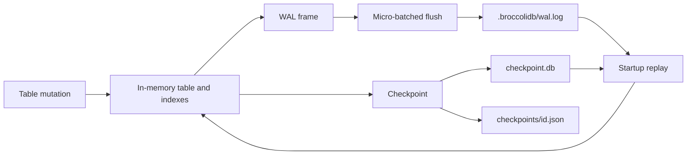

# @noorm/broccolidb

Dependency-free embedded JSON database for Node.js.

BroccoliDB is an embeddable TypeScript database for local application state. It
offers typed in-memory tables and an optional, dependency-free SQLite-inspired
JSONSQL subset over the same records. The kernel persists changes through a
micro-batched write-ahead log (WAL), versioned base snapshots with optional
named checkpoint history, and an optional content-addressable storage (CAS)
vault for large blobs. It runs inside your
Node.js process; it does not start a server or use a native database driver.

> JSONSQL provides familiar table and query syntax for common single-table work.
> It is a deliberately small dialect, not a SQLite or PostgreSQL server and not
> a drop-in driver replacement. See [JSONSQL boundaries](#jsonsql-boundaries).

[](https://nodejs.org/)
[](https://www.typescriptlang.org/)
[](#portability-and-boundaries)
[](LICENSE)

## Table of contents

- [At a glance](#at-a-glance)
- [Quick start](#quick-start)
- [JSONSQL boundaries](#jsonsql-boundaries)
- [How durability works](#how-durability-works)
- [Public surface](#public-surface)
- [Storage layout](#storage-layout)
- [Portability and boundaries](#portability-and-boundaries)
- [Documentation](#documentation)
- [Security](#security)
- [Development and verification](#development-and-verification)
- [Compatibility policy](#compatibility-policy)
- [Licensing and IP](#licensing-and-ip)
- [License](#license)

## At a glance

| Capability | What it provides |
|---|---|
| In-memory tables | Typed records, CRUD, bulk writes, TTL expiration, snapshots, and reactive change events |
| Indexes | Equality, sorted/range, composite, and prefix indexes |
| Queries | Typed filters, boolean clauses, ordering, pagination, a fluent builder, and deterministic natural-language parsing |
| JSONSQL | Prepared `?` bindings, typed table schemas, single-table SELECT and basic INSERT/UPDATE/DELETE |
| Aggregation | `sum`, `avg`, `min`, `max`, `count`, `stddev`, grouping, `having`, and grand totals |
| Durability | Micro-batched WAL frames, checksum validation, WAL compaction, named checkpoint rotation, replay, and rollback |
| Blob storage | SHA-256 addressed files, optional Brotli compression, read verification, quarantine, and garbage collection |
| Coordination | Re-entrant process-local mutex and explicit WAL flush boundary |
| Portability | ESM package, zero runtime dependencies, no native ABI or server |

## Quick start

```bash
npm install @noorm/broccolidb
```

```ts
import { BroccoliDatabaseKernel } from "@noorm/broccolidb"

type User = {
  id: string
  name: string
  team: string
  active: boolean
}

const db = new BroccoliDatabaseKernel({ workspaceRoot: "./state" })
await db.start()

const users = db.getTable<User>("users")
users.createIndex("team")
users.createIndex("active")

users.put("user-1", { id: "user-1", name: "Ada", team: "platform", active: true })
users.put("user-2", { id: "user-2", name: "Grace", team: "platform", active: false })

const activePlatformUsers = users.query({
  where: { team: "platform", active: true },
})

console.log(activePlatformUsers)
console.log(await db.health())

await db.checkpoint("after-initial-users")
await db.stop()
```

For bulk ingestion, use `putMany()` and place an explicit `flush()` after the
batch when later work depends on durable state. The table applies constraints
and index changes to the affected rows, while the WAL writes checksummed
per-row frames in a micro-batched filesystem operation. Large imports should
use bounded batches so the application can yield between them.

### Use the SQL-shaped API when it fits

`db.sql.prepare()` parses one supported statement and keeps values separate
from SQL text through positional `?` bindings. This is useful when table schemas
and query clauses read more clearly in familiar SQL syntax:

```ts
const sqlDb = new BroccoliDatabaseKernel({ workspaceRoot: "./sql-state" })
await sqlDb.start()

const createTasks = sqlDb.sql.prepare(`
  CREATE TABLE tasks (
    id TEXT PRIMARY KEY,
    title TEXT NOT NULL,
    status TEXT NOT NULL DEFAULT 'open',
    priority INTEGER NOT NULL DEFAULT 0
  )
`)
createTasks.run()

const insertTask = sqlDb.sql.prepare(
  "INSERT INTO tasks (id, title, priority) VALUES (?, ?, ?)",
)
insertTask.run("task-1", "Review recovery behavior", 2)

const openTasks = sqlDb.sql.prepare(`
  SELECT id, title, priority
  FROM tasks
  WHERE status = ? AND priority >= ?
  ORDER BY priority DESC, title ASC
  LIMIT ?
`)
console.log(openTasks.all("open", 1, 20))

await sqlDb.flush()
await sqlDb.stop()
```

The typed table API and JSONSQL share the same tables, constraints, WAL, and
checkpoints. Schemas are saved in an internal catalog table and restored after
checkpoint loading and WAL replay. Use `await db.flush()` or `await db.stop()`
when the caller needs the queued writes persisted.

The package is ESM-only. The `workspaceRoot` directory is created on demand;
the kernel stores its durable state below `workspaceRoot/.broccolidb/`.

## How durability works



A mutation updates the in-memory table immediately and schedules a WAL frame.
Call `flush()`, use `transaction()` with a successful callback, call
`checkpoint()`, or shut down with `stop()` when the application needs the
buffered frames written before it continues. `transaction()` coordinates with
other kernel mutex operations but does not isolate or roll back direct table
writes. On the next `start()`, BroccoliDB loads the latest base checkpoint
and replays the remaining WAL frames. Replay recomputes each frame checksum,
validates a declared previous-frame link when present, and rejects malformed
frame sequences. The current versioned base checkpoint also verifies its
snapshot hash before records are loaded. Legacy frames that omit link metadata
remain readable using the expected prior checksum as their checksum input.
An invalid, unterminated final JSONL record is treated as a torn append and
removed only after every complete frame before it passes integrity checks. A
valid final frame missing its newline is repaired; malformed complete frames
remain fatal. `health()` reports the recovery and repaired-terminator counters.
WAL creation, checkpoint replacement, and CAS writes sync file contents before
rename and sync parent directories where the platform supports it.

For a named restore point, use:

```ts
const checkpoint = await db.checkpoint("before-import")
// ... perform work ...
await db.rollback(checkpoint.checkpointId)
```

The checkpoint record contains a timestamp, frame index, record counts, and a
SHA-256 hash of the serialized table snapshot. WAL rotation uses the captured
frame boundary, so writes appended while checkpoint files are being saved
remain in the WAL for replay. See the [operations guide](docs/OPERATIONS.md) for
backup, corruption, and multi-process guidance.

## Public surface

The package entry point re-exports the contracts and implementations needed by
an embedding application:

| Area | Primary exports | Source |
|---|---|---|
| Kernel | `BroccoliDatabaseKernel`, `broccolidb`, `DatabaseKernelOptions` | `src/broccolidb-kernel.ts` |
| Tables and contracts | `IDbTable`, `DbQueryOptions`, `DbPutOptions`, index/query/change types | `src/broccolidb.contracts.ts` |
| Queries | `BroccoliNaturalQueryParser`, `IFluentQueryBuilder` | `src/broccolidb-natural-query.ts` and contracts |
| SQL-shaped queries | `JsonSqlDatabase`, `JsonSqlStatement`, `JsonSqlError` | `src/broccolidb-jsonsql.ts` |
| Aggregation | `DbAggregateQuery`, `DbAggregateResult`, aggregate metrics | `src/broccolidb-aggregation.ts` and contracts |
| WAL | `BroccoliWriteAheadLog`, `WalIntegrityError`, `WalFrame` | `src/broccolidb-wal.ts` |
| CAS | `BroccoliCASStorageService`, `StorageIntegrityError` | `src/broccolidb-cas.ts` |
| Checkpoints | `CheckpointIntegrityError` | `src/broccolidb-kernel.ts` |
| Locking | `ReentrantAsyncMutex`, `DatabaseLockError`, `DeadlockTimeoutError` | `src/broccolidb-mutex.ts` |
| Prompt compression | `TokenCompressionService`, `tokenCompressionService` | `src/TokenCompressionService.ts` |

The detailed signatures and examples live in the [API reference](docs/API.md).

## Storage layout

```text
<workspaceRoot>/
└── .broccolidb/
    ├── wal.log                  # append-only JSONL mutation journal
    ├── wal.log.old              # legacy backup that may remain from older versions
    ├── checkpoint.db            # versioned base snapshot, including JSONSQL schemas
    ├── checkpoints/<id>.json    # named checkpoint history
    └── cas/
        ├── blobs/<00-ff>/<sha>  # content-addressed payloads
        └── corrupt/             # quarantined payloads and manifest.jsonl
```

Treat this directory as application state. Back it up only while the kernel is
stopped or after an explicit `flush()`/`checkpoint()`. Do not edit WAL or
checkpoint files by hand; malformed WAL and checkpoint data raise
`WalIntegrityError` and `CheckpointIntegrityError`, respectively.

## Portability and boundaries

BroccoliDB intentionally has:

- zero production dependencies in `package.json`;
- no SQLite or PostgreSQL driver, native module, or Electron ABI coupling;
- no network service, daemon, or background process;
- ordinary JSON, JSONL, SHA-256, Brotli, and filesystem primitives;
- a small `db.sql.prepare()` dialect over in-memory JSON tables;
- a Node.js `>=18` engine requirement.

## JSONSQL boundaries

JSONSQL follows familiar SQLite-style statement and binding patterns for
single-table CRUD. It supports `CREATE TABLE`, `SELECT`, one-row `INSERT`,
`UPDATE`, and `DELETE`; typed columns; primary and unique constraints; common
predicates; ordering; and pagination. The API is synchronous and embedded in
the kernel.

It does not implement the SQLite or PostgreSQL dialects, a wire protocol,
joins, subqueries, aggregate expressions, SQL indexes, schema migrations,
`ALTER TABLE`, `DROP TABLE`, upserts, or SQL transactions. Types are checked
strictly without SQL affinity, and SELECT currently scans the selected table in
memory. JSON values use structural equality; ordered comparisons for JSON
objects and arrays evaluate as unknown. `LIKE` evaluation is synchronous and
has a 10,000,000-cell work limit per query to bound worst-case scans. For larger
relational workloads, multi-process writers, or broad SQL compatibility, use a
dedicated database engine.

The kernel's `transaction()` method holds a process-local coordination mutex
and flushes after a successful callback. It does not roll back table changes or
isolate direct table writes, so it is not an SQL transaction.

BroccoliDB also does not provide a cross-process lock, a replicated log, or
provider-specific billing/token accounting. The prompt token compressor uses a
four-characters-per-token estimate as a budget signal, not as an API provider
billing measurement.

## Documentation

The documentation follows a layered path: **Concepts → How it works →
Reference → Operations → Decisions**.

- [Documentation map](docs/README.md) — choose a reading path by role.
- [Brief](docs/BRIEF.md) — problem, solution, guarantees, and fit.
- [Architecture](docs/ARCHITECTURE.md) — layers, lifecycle, files, and failure model.
- [API reference](docs/API.md) — public types, methods, and query examples.
- [Operations guide](docs/OPERATIONS.md) — durability, backup, recovery, health, and GC.
- [Troubleshooting](docs/TROUBLESHOOTING.md) — symptom → cause → action runbooks.
- [Glossary](docs/GLOSSARY.md) — canonical vocabulary.
- [Design philosophy](docs/PHILOSOPHY.md) — principles and rejected alternatives.
- [Architecture decisions](docs/adr/README.md) — durable decisions and their consequences.
- [Contributing](docs/CONTRIBUTING.md) — source map, workflow, and contract checklist.
- [Agent guide](AGENTS.md) — scoped delegation, review ownership, and repository boundaries.
- [Release notes](docs/RELEASE_NOTES.md) — supported package history.
- [Claim register](docs/ip/CLAIM-REGISTER.md) — evidence-bounded technical and
  IP statements.

## Security

See [SECURITY.md](SECURITY.md) for private vulnerability reporting, supported
release lines, and the package's explicit security boundaries.

## Development and verification

```bash
npm install
npm run build
npm test
npm run docs:check
npm run license:check
npm run ip:check
npm run package:check
npm run check
npm pack --dry-run
```

`npm test` builds the package and runs the TypeScript tests under `test/`.
`npm run docs:check` verifies the documentation map and required relative
links. `npm run license:check` checks source/generated SPDX coverage and the
Apache package boundary. `npm run ip:check` audits evidence-bounded claims.
`npm run package:check` inspects the actual npm dry-run file list for required
legal artifacts and excluded development surfaces.
`npm run check` is the release-oriented local gate.

## Compatibility policy

The standalone package is the supported BroccoliDB implementation. The removed
in-repository SQLite implementation is not a compatibility target, and
JSONSQL does not preserve SQLite, PostgreSQL, Kysely, or native-driver APIs.
New code should import `@noorm/broccolidb` from the package entry point and
should not recreate a private table/WAL implementation inside an application.

Changes to exported types, on-disk formats, WAL replay, checkpoint structure, or
CAS integrity behavior require an API/operations documentation update and an
entry in the ADR or release notes.

## Licensing and IP

The `3.0.0` and later release line is licensed under the Apache License 2.0.
See [LICENSE](LICENSE), [NOTICE](NOTICE), the [defensive patent and IP
policy](PATENT-NON-AGGRESSION-PLEDGE.md), and the [trademark policy](TRADEMARKS.md).

BroccoliDB `2.0.x` was published under the MIT License. That historical grant
remains available for those versions; changing this repository cannot
retroactively revoke permissions already granted to recipients of a published
release.

Apache-2.0 is the LUMI-compatible open-source protection strategy: it preserves
copyright, attribution, and NOTICE requirements; provides an express patent
grant with defensive termination; and does not grant a trademark license. It
still permits commercial use and closed larger works. If the business goal is to
prohibit commercial use or require a commercial license, that requires a
separate, counsel-reviewed source-available or dual-licensing plan; adding a
contrary sentence to this README would not override Apache-2.0.

The repository’s technical provenance and prior-art evidence are recorded in
the [IP record](docs/ip/README.md). Those records are engineering evidence,
not patent claims or legal advice.

## License

Apache-2.0. See [LICENSE](LICENSE), [NOTICE](NOTICE), and [LEGAL-STRATEGY.md](docs/LEGAL-STRATEGY.md).
