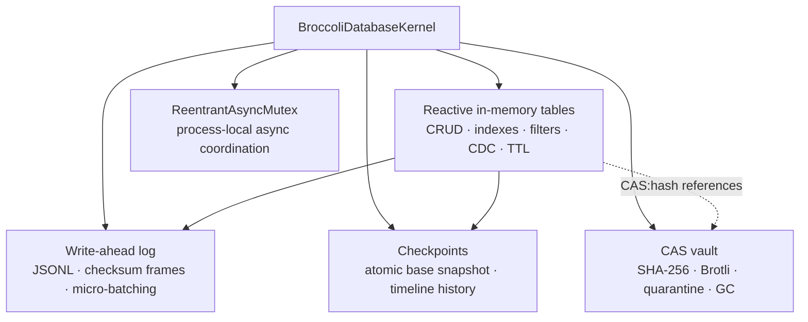
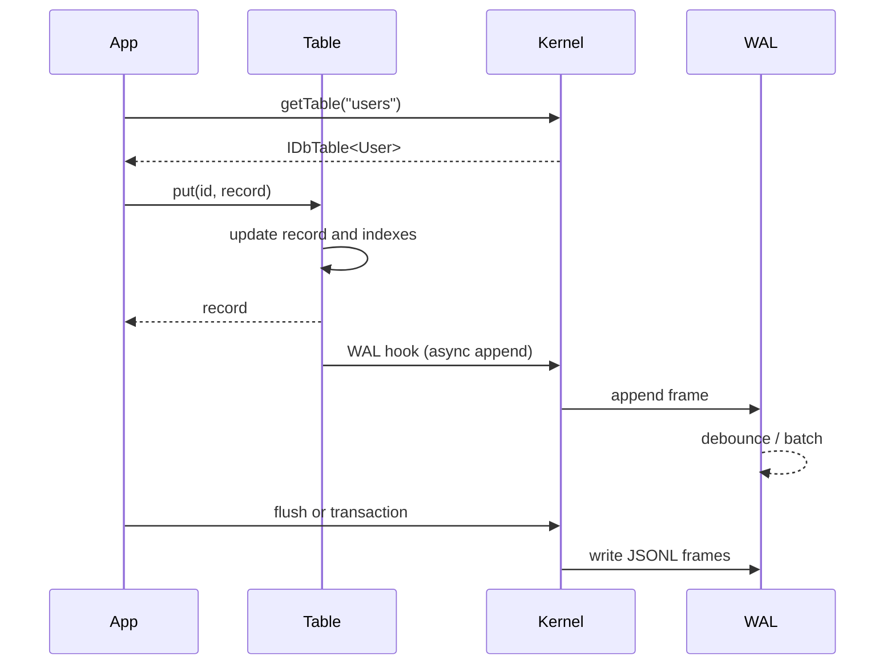

# Architecture

BroccoliDB is a four-layer embedded kernel with a process-local coordination
boundary. The layers are deliberately composable: tables can be used directly,
while the kernel adds WAL, checkpoints, CAS, and lifecycle management.

## Layer map

| Layer | Responsibility | Implementation |
|---|---|---|
| **L1 tables** | In-memory records, indexes, filtering, aggregation, fluent queries, TTL, CDC | `src/broccolidb-table.ts` |
| **L2 WAL** | Append mutation frames, micro-batched flush, checksum validation, replay, rotation | `src/broccolidb-wal.ts` |
| **L3 CAS** | Content-addressed blobs, optional Brotli compression, hash verification, quarantine, mark-sweep | `src/broccolidb-cas.ts` |
| **L4 checkpointing** | Atomic base snapshot, checkpoint history, rollback metadata | `src/broccolidb-kernel.ts` |
| **Coordination** | Re-entrant async lock for transactions and serialized WAL/checkpoint operations | `src/broccolidb-mutex.ts` |
| **Contracts** | Public types and behavior vocabulary | `src/broccolidb.contracts.ts` |

## Startup and recovery

`start()` is idempotent. The kernel performs the following sequence:

1. Create `.broccolidb/` and its checkpoint directory.
2. Start the CAS service and WAL service.
3. Load `.broccolidb/checkpoint.db` if it exists.
4. Replay frames remaining in `.broccolidb/wal.log`.
5. Mark the kernel started.

Checkpoint data is loaded into tables before WAL replay. A missing base snapshot
is treated as a fresh database. A malformed or checksum-invalid WAL frame is a
`WalIntegrityError` and should be investigated rather than silently discarded.

## Mutation flow

The table mutation is synchronous from the caller's perspective. The table's
WAL hook schedules an asynchronous frame append, so callers that need a durable
boundary must await `flush()`, `transaction()`, `checkpoint()`, or `stop()`.

## Checkpoint flow

`checkpoint(label)` runs under the kernel mutex:

1. Flush pending WAL frames.
2. Serialize every currently registered table.
3. Compute a SHA-256 snapshot hash.
4. Write a temporary base file and rename it to `checkpoint.db`.
5. Write a named history file under `checkpoints/<checkpointId>.json`.
6. Cache the timeline record and in-memory snapshots.
7. Rotate the WAL and append a checkpoint marker.

The double-buffered base write protects the previous base snapshot if the
process fails during the write. Checkpoint history is ordinary JSON and can be
copied with the rest of `.broccolidb/`.

## Rollback flow

`rollback(checkpointId)` first checks the process-local snapshot cache. If the
checkpoint was created in the current process, it restores those maps directly.
Otherwise it loads the checkpoint history JSON and rebuilds the checkpoint's
tables. It appends a rollback marker to the WAL. The method returns `false` when
the requested history file cannot be read or parsed.

Rollback is an application state operation, not a distributed transaction or a
schema migration. Take a backup before destructive rollback workflows.

## Table execution model

Each table owns:

- a `Map<string, T>` of records;
- equality maps for exact lookups;
- sorted entries for range/order queries;
- composite maps keyed by field tuples;
- prefix maps for string-prefix lookups;
- subscriptions and TTL timers;
- the query, aggregation, and fluent-builder helpers.

The query planner reports the selected `scanStrategy`, matched index, candidate
count, match count, and elapsed microseconds through `explain()`. A query can
fall back to `FULL_TABLE_SCAN`; creating an index is an optimization, not a
semantic requirement.

## CAS model

The CAS service hashes raw content before storage. Blobs are sharded by the
first two hash characters and stored with a small format marker:

- `BR_RAW\0` for uncompressed bytes;
- `BR_BRZ\0` for Brotli-compressed bytes when the compressed representation
  meets the savings threshold.

Reads decompress when needed, recompute the raw SHA-256, and quarantine a blob
when decompression or hash verification fails. `BroccoliDatabaseKernel.gc()`
collects hashes referenced by string fields beginning with `CAS:` in current
table records.

## Failure model

| Failure | Behavior | Caller action |
|---|---|---|
| Missing workspace directory | Created on `start()` | Normal startup |
| Missing checkpoint | Treated as fresh state | Continue or restore a backup |
| Invalid WAL JSON/checksum | `WalIntegrityError` during replay | Preserve the directory, inspect/restore, then retry |
| Unreadable CAS blob | `null` for missing blob; integrity error for corruption | Inspect quarantine manifest and restore if needed |
| Non-writable state directory | Health status is degraded/corrupted | Fix permissions or choose another root |
| Mutex wait exceeds timeout | `DeadlockTimeoutError` | Find long-held/nested lock or reduce contention |
| Process termination before flush | Recent buffered frames may be absent | Use explicit transaction/flush boundaries |

## Implementation map

| Concern | File |
|---|---|
| Export surface | `src/index.ts` |
| Types and public contracts | `src/broccolidb.contracts.ts` |
| Kernel lifecycle and recovery | `src/broccolidb-kernel.ts` |
| Table/index/query behavior | `src/broccolidb-table.ts` |
| Aggregation | `src/broccolidb-aggregation.ts` |
| Natural-language parser | `src/broccolidb-natural-query.ts` |
| WAL | `src/broccolidb-wal.ts` |
| CAS | `src/broccolidb-cas.ts` |
| Mutex | `src/broccolidb-mutex.ts` |
| Prompt compression | `src/TokenCompressionService.ts` |
| Contract tests | `test/` |
